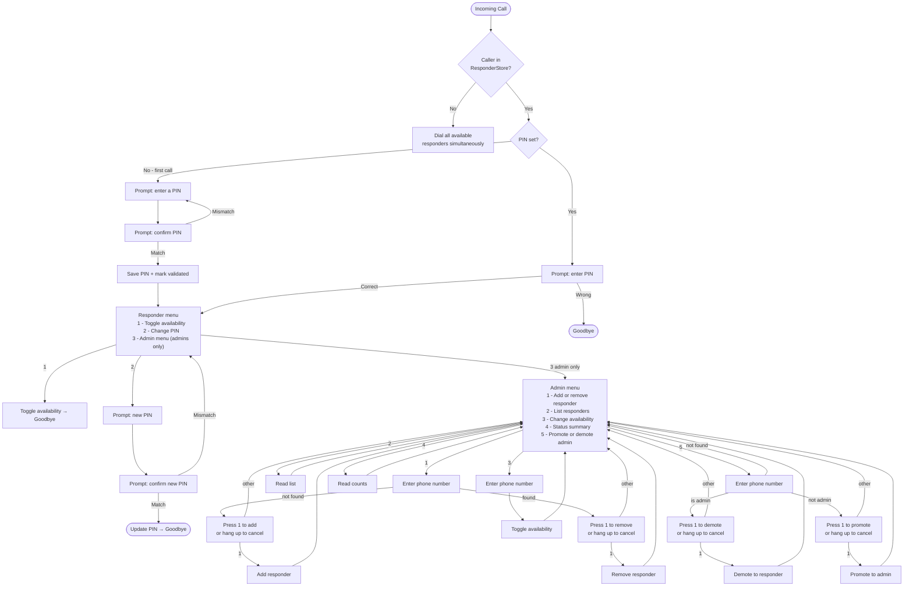

# respond

On-call responder service using FreeSWITCH + VoIP.ms for voice and SMS. When an unknown caller dials the number, it simultaneously rings all available responders. Responders can toggle their own availability by calling in. Admins (verified by caller ID + PIN) can manage the responder list via a phone menu. Customers can also interact via SMS through a configurable decision tree.

## Architecture

```
Inbound call → VoIP.ms SIP trunk → FreeSWITCH (VPS)
                                        │ mod_xml_curl
                                   Go app (K8s)
                                        │
                                   PostgreSQL

Inbound SMS → VoIP.ms HTTP webhook → Go app (K8s)
                                        │
                               SMS decision tree engine
                                        │
                               VoIP.ms REST API (outbound SMS)
```

- **FreeSWITCH** runs on a standalone VPS, handles SIP/RTP, calls the Go app via `mod_xml_curl` on each call event
- **Go app** is stateless, runs on Kubernetes, serves FreeSWITCH XML dialplan responses and SMS webhook handlers
- **VoIP.ms** provides PSTN connectivity (SIP trunk for voice, HTTP webhooks for SMS)

## Call Flow



## SMS Flow

Customers can text the VoIP.ms DID number. The app walks them through a configurable decision tree (defined in `sms-tree.yaml`) and optionally notifies on-call responders.

See [SMS Decision Tree](#sms-decision-tree) for configuration.

## Configuration

### Go App (Kubernetes)

| Env Var | Description |
|---------|-------------|
| `DATABASE_URL` | PostgreSQL connection string |
| `FS_SHARED_SECRET` | Shared secret for FreeSWITCH webhook validation |
| `VOIPMS_USERNAME` | VoIP.ms API username |
| `VOIPMS_PASSWORD` | VoIP.ms API password |
| `VOIPMS_DID` | VoIP.ms DID to send outbound SMS from |
| `SMS_TREE_PATH` | Path to SMS decision tree YAML (default: `/config/sms-tree.yaml`) |
| `BASE_URL` | Public HTTPS URL of this service (e.g. `https://respond.example.com`) |
| `PORT` | HTTP listen port (default: `8080`) |
| `BOOTSTRAP_ADMINS` | Comma-separated `phone:pin` pairs to seed on first start |

### HTTP Endpoints

| Method | Path | Description |
|--------|------|-------------|
| POST | `/fs/voice` | FreeSWITCH entry point for inbound calls |
| POST | `/fs/gather` | FreeSWITCH DTMF input handler |
| POST | `/fs/status` | FreeSWITCH call status callback (cleans up sessions) |
| POST | `/sms/inbound` | VoIP.ms inbound SMS webhook |
| GET | `/healthz` | Health check |

`/fs/*` endpoints are protected by `X-FS-Secret` header validation (or restrict by IP at ingress — see [Security](#security)).

## FreeSWITCH Setup

See [`freeswitch/README.md`](freeswitch/README.md) for full setup instructions. Summary:

1. Install FreeSWITCH on a dedicated VPS with `mod_xml_curl`, `mod_flite`, `mod_sofia`
2. Copy config files from `freeswitch/` to `/etc/freeswitch/`
3. Set VoIP.ms SIP credentials in `sip_profiles/voipms.xml`
4. Point `mod_xml_curl` at `https://respond.example.com/fs/voice`
5. In VoIP.ms portal, point your DID at `sip:YOUR_DID@YOUR_VPS_IP`

## SMS Decision Tree

Define the customer-facing SMS conversation in a YAML file:

```yaml
greeting: "Hi! How can we help? Reply with a number."
timeout_minutes: 30
nodes:
  root:
    prompt: "Are you experiencing: 1) Issue A  2) Issue B  3) Other"
    options:
      "1": node_a
      "2": node_b
      "3": node_other
  node_a:
    response: "For issue A, call 555-1234."
  node_b:
    prompt: "Is this urgent? Y or N."
    options:
      Y: node_b_urgent
      N: node_b_normal
  node_b_urgent:
    response: "An on-call responder will contact you shortly."
    action: notify_responders
  node_b_normal:
    response: "Please email support@example.com."
  node_other:
    response: "Call our main line at 555-0000."
```

Mount this file as a Kubernetes ConfigMap at `/config/sms-tree.yaml`. The tree is validated at startup — missing node references cause a fatal error.

Terminal nodes with `action: notify_responders` will SMS all currently available responders with the customer's number.

## Security

- `/fs/*` endpoints: `mod_xml_curl` does not support custom request headers, so the shared-secret header approach requires network-level enforcement. **Restrict `/fs/*` ingress to the FreeSWITCH VPS IP only** rather than relying on `FS_SHARED_SECRET` alone.
- `/sms/inbound`: Validated by VoIP.ms source IP at the infrastructure level.
- Admin authentication: caller ID allowlist + bcrypt PIN (two factors).
- All secrets in Kubernetes `Secret` objects.

## Deployment

```bash
helm upgrade --install respond charts/respond/ \
  --set secrets.databaseUrl="postgresql://..." \
  --set secrets.fsSharedSecret="..." \
  --set secrets.voipmsUsername="..." \
  --set secrets.voipmsPassword="..." \
  --set secrets.voipmsDid="5551234567" \
  --set ingress.host="respond.example.com" \
  --set config.baseUrl="https://respond.example.com"
```

Mount the SMS tree ConfigMap:

```bash
kubectl create configmap sms-tree --from-file=sms-tree.yaml=./sms-tree.yaml
```

## Seeding Initial Admins

Set `BOOTSTRAP_ADMINS` to a comma-separated list of `phone:pin` pairs. On first start (when no admins exist), these are inserted automatically:

```
BOOTSTRAP_ADMINS=+15551234567:1234,+15559876543:5678
```
