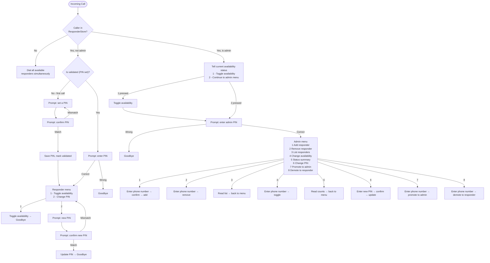

# respond

Twilio-based on-call responder service. When an unknown caller dials your Twilio number, it simultaneously rings all available responders. Responders can toggle their own availability by calling in. Admins (verified by caller ID + PIN) can manage the responder list via a phone menu.

## Call Flow



## Configuration

| Env Var | Description |
|---------|-------------|
| `DATABASE_URL` | PostgreSQL connection string |
| `TWILIO_AUTH_TOKEN` | Twilio Auth Token (for signature validation) |
| `BASE_URL` | Public HTTPS URL of this service (e.g. `https://respond.example.com`) |
| `PORT` | HTTP listen port (default: `8080`) |

## Twilio Setup

1. Point your Twilio number's Voice webhook to `POST https://respond.example.com/twilio/voice`
2. Set the Status Callback to `POST https://respond.example.com/twilio/status`

## Deployment

```bash
helm upgrade --install respond charts/respond/ \
  --set secrets.databaseUrl="postgresql://..." \
  --set secrets.twilioAuthToken="..." \
  --set ingress.host="respond.example.com" \
  --set config.baseUrl="https://respond.example.com"
```

## Seeding Initial Data

Connect to the database and insert your first admin directly:

```sql
INSERT INTO admins (phone_number, name, pin_hash)
VALUES ('+15551234567', 'Alice', crypt('your-pin', gen_salt('bf')));
```

Or use a one-off Go CLI tool (not included — add as needed).
